# System Architecture Analysis
<!-- generated in 0.00s -->

## Overview

- **Project**: /home/tom/github/semcod/env2llm
- **Primary Language**: python
- **Languages**: python: 41, shell: 2, yaml: 1, toml: 1
- **Analysis Mode**: static
- **Total Functions**: 185
- **Total Classes**: 26
- **Modules**: 46
- **Entry Points**: 37

## Architecture by Module

### src.env2llm.doql.parse
- **Functions**: 25
- **File**: `parse.py`

### src.env2llm.policy.process
- **Functions**: 20
- **File**: `process.py`

### src.env2llm.render.doql.blocks
- **Functions**: 18
- **File**: `blocks.py`

### src.env2llm.doql.runtime
- **Functions**: 15
- **File**: `runtime.py`

### src.env2llm.doql.context_blocks
- **Functions**: 14
- **File**: `context_blocks.py`

### src.env2llm.layout
- **Functions**: 14
- **File**: `layout.py`

### src.env2llm.registry
- **Functions**: 12
- **File**: `registry.py`

### src.env2llm.render.doql.helpers
- **Functions**: 7
- **File**: `helpers.py`

### src.env2llm.policy.validations
- **Functions**: 6
- **File**: `validations.py`

### src.env2llm.sources
- **Functions**: 6
- **Classes**: 2
- **File**: `sources.py`

### src.env2llm.generate
- **Functions**: 5
- **File**: `generate.py`

### src.env2llm.bridge
- **Functions**: 5
- **File**: `bridge.py`

### src.env2llm.runtimes
- **Functions**: 4
- **File**: `runtimes.py`

### src.env2llm.system_map_models
- **Functions**: 4
- **File**: `system_map_models.py`

### src.env2llm.ir
- **Functions**: 4
- **Classes**: 17
- **File**: `ir.py`

### src.env2llm.doql.models
- **Functions**: 4
- **Classes**: 7
- **File**: `models.py`

### src.env2llm.env
- **Functions**: 3
- **File**: `env.py`

### src.env2llm.formats
- **Functions**: 3
- **File**: `__init__.py`

### src.env2llm.policy.invoice
- **Functions**: 3
- **File**: `invoice.py`

### src.env2llm.bootstrap
- **Functions**: 3
- **File**: `bootstrap.py`

## Key Entry Points

Main execution flows into the system:

### src.env2llm.formats.markdown.render_markdown
- **Calls**: sorted, lines.extend, lines.extend, None.items, lines.append, None.join, lines.append, None.join

### src.env2llm.layout.write_turn_snapshot
> Persist one conversation turn under runs/{run_id}/.
- **Calls**: None.resolve, src.env2llm.layout.run_dir, out_path.write_text, None.replace, response.get, None.isoformat, response.get, response.get

### src.env2llm.sources.DefaultEnvironmentSources.services_snapshot
- **Calls**: isinstance, isinstance, path.is_file, yaml.safe_load, isinstance, path.read_text, doc.get, doc.get

### src.env2llm.doql.runtime.merge_inline_context
> Merge portable chat context_json values into a DOQL task context.
- **Calls**: dict, inline.items, src.env2llm.doql.runtime._inline_data_key, conv_key.startswith, src.env2llm.doql.runtime._add_short_inline_alias, key.startswith, src.env2llm.doql.runtime._apply_conversation_flag, bool

### src.env2llm.layout.write_reflection_snapshot
> Persist reflection report under runs/{run_id}/reflect-NN-{phase}.json.
- **Calls**: None.resolve, src.env2llm.layout.run_dir, out_path.write_text, None.replace, Path, json.dumps, phase.replace, dict

### src.env2llm.generate._litellm_complete
- **Calls**: os.getenv, os.getenv, litellm.completion, str, float, int, os.getenv, os.getenv

### src.env2llm.policy.process.process_scope_denied
> Return user message when action is outside process_access scope.
- **Calls**: None.strip, set, set, action.startswith, deny.intersection, None.join, sorted

### src.env2llm.doql.runtime.autofill_entities
> Fill missing action.field slots from ctx.data. Returns (updated_entities, filled_keys).
- **Calls**: dict, list, src.env2llm.doql.runtime._split_missing_ref, src.env2llm.doql.runtime._autofill_value, src.env2llm.doql.runtime._needs_field, filled.append

### src.env2llm.layout.clean_all_example_artifacts
> Clean ``.nlp2dsl/`` for every ``examples/*/`` directory.
- **Calls**: None.resolve, sorted, base.iterdir, src.env2llm.layout.clean_artifact_root, Path, example_dir.is_dir

### src.env2llm.layout.write_last_run_report
- **Calls**: None.resolve, src.env2llm.layout.ensure_layout, path.write_text, Path, json.dumps, dict

### src.env2llm.cli.main
- **Calls**: None.parse_args, src.env2llm.formats.normalize_format, src.env2llm.bootstrap.ensure_environment_map, print, Path, src.env2llm.cli.build_parser

### src.env2llm.sources.DefaultEnvironmentSources.example_profile
- **Calls**: doc.get, isinstance, path.is_file, yaml.safe_load, isinstance, path.read_text

### src.env2llm.system_map_models.validate_config_against_map
> Validate config with dynamic model; raises ValidationError on failure.
- **Calls**: ir.command, src.env2llm.system_map_models.command_input_model, None.model_dump, ValueError, model.model_validate

### src.env2llm.sources.DefaultEnvironmentSources.platform_config
- **Calls**: isinstance, path.is_file, yaml.safe_load, merged.update, path.read_text

### src.env2llm.ir.SystemMapIR.validate_step_config
> Return missing field names for action against this map.
- **Calls**: self.command, config.get, missing.append, isinstance, val.strip

### src.env2llm.doql.render.write_doql_context
- **Calls**: Path, path.parent.mkdir, path.write_text, src.env2llm.doql.render.render_doql_context

### src.env2llm.doql.runtime.load_doql_inline_from_env
- **Calls**: src.env2llm.doql.runtime.resolve_doql_context_path, src.env2llm.doql.runtime.context_inline_payload, src.env2llm.doql.parse.load_doql_context

### src.env2llm.bridge.doql_file_to_system_map
> Parse environment.doql.less → SystemMapIR (round-trip via DoqlTaskContext).
- **Calls**: Path, src.env2llm.doql.parse.load_doql_context, src.env2llm.bridge.task_context_to_system_map

### src.env2llm.doql.models.DoqlTaskContext.entity_values
- **Calls**: self.data.items, key.startswith, len

### src.env2llm.doql.models.DoqlTaskContext.runtime_for
- **Calls**: self.command, src.env2llm._runtime_health.runtime_id_for_intent, any

### src.env2llm.formats.yaml_fmt.render_yaml
- **Calls**: ir.model_dump, yaml.safe_dump

### src.env2llm.formats.json_fmt.render_json
- **Calls**: ir.model_dump, json.dumps

### src.env2llm.layout.example_fixtures_dir
> Static fixtures outside generated .nlp2dsl (not removed on clean).
- **Calls**: None.resolve, Path

### src.env2llm.ir.SystemMapIR.runtime_for_command
- **Calls**: self.command, self.runtime

### src.env2llm.doql.models.DoqlTaskContext.required_fields_for
- **Calls**: self.command, list

### src.env2llm.formats.doql_less.render_doql_less
- **Calls**: src.env2llm.render.doql.render.render_system_map_doql

### src.env2llm.policy.process.effective_nlp_parser_mode
> Map DOQL nlp_parser → runtime parser mode (rules | llm | auto).
- **Calls**: None.lower

### src.env2llm.system_map_models.build_command_registry
- **Calls**: src.env2llm.system_map_models.command_input_model

### src.env2llm.registry.refresh_doql_registry_from_state
- **Calls**: src.env2llm.registry.refresh_doql_registry

### src.env2llm.bootstrap.ensure_doql_registry
> nlp2dsl-compatible alias for :func:`ensure_environment_map`.
- **Calls**: src.env2llm.bootstrap.ensure_environment_map

## Process Flows

Key execution flows identified:

### Flow 1: render_markdown
```
render_markdown [src.env2llm.formats.markdown]
```

### Flow 2: write_turn_snapshot
```
write_turn_snapshot [src.env2llm.layout]
  └─> run_dir
      └─> current_run_id
```

### Flow 3: services_snapshot
```
services_snapshot [src.env2llm.sources.DefaultEnvironmentSources]
```

### Flow 4: merge_inline_context
```
merge_inline_context [src.env2llm.doql.runtime]
  └─> _inline_data_key
  └─> _add_short_inline_alias
```

### Flow 5: write_reflection_snapshot
```
write_reflection_snapshot [src.env2llm.layout]
  └─> run_dir
      └─> current_run_id
```

### Flow 6: _litellm_complete
```
_litellm_complete [src.env2llm.generate]
```

### Flow 7: process_scope_denied
```
process_scope_denied [src.env2llm.policy.process]
```

### Flow 8: autofill_entities
```
autofill_entities [src.env2llm.doql.runtime]
  └─> _split_missing_ref
      └─> _canonical_field
  └─> _autofill_value
      └─> _value_from_data
      └─> _value_from_artifacts
```

### Flow 9: clean_all_example_artifacts
```
clean_all_example_artifacts [src.env2llm.layout]
  └─> clean_artifact_root
      └─> artifact_root
      └─> _force_remove_path
```

### Flow 10: write_last_run_report
```
write_last_run_report [src.env2llm.layout]
  └─> ensure_layout
```

## Key Classes

### src.env2llm.ir.SystemMapIR
> env2llm.system_map.v1 — canonical map of available system capabilities.

Generated at runtime by Sys
- **Methods**: 4
- **Key Methods**: src.env2llm.ir.SystemMapIR.command, src.env2llm.ir.SystemMapIR.runtime, src.env2llm.ir.SystemMapIR.runtime_for_command, src.env2llm.ir.SystemMapIR.validate_step_config
- **Inherits**: BaseModel

### src.env2llm.doql.models.DoqlTaskContext
- **Methods**: 4
- **Key Methods**: src.env2llm.doql.models.DoqlTaskContext.entity_values, src.env2llm.doql.models.DoqlTaskContext.command, src.env2llm.doql.models.DoqlTaskContext.required_fields_for, src.env2llm.doql.models.DoqlTaskContext.runtime_for

### src.env2llm.sources.EnvironmentSources
- **Methods**: 3
- **Key Methods**: src.env2llm.sources.EnvironmentSources.example_profile, src.env2llm.sources.EnvironmentSources.platform_config, src.env2llm.sources.EnvironmentSources.services_snapshot
- **Inherits**: Protocol

### src.env2llm.sources.DefaultEnvironmentSources
> Read nlp2dsl-style YAML layouts (example-profiles.yaml, nlp2dsl.yaml).
- **Methods**: 3
- **Key Methods**: src.env2llm.sources.DefaultEnvironmentSources.example_profile, src.env2llm.sources.DefaultEnvironmentSources.platform_config, src.env2llm.sources.DefaultEnvironmentSources.services_snapshot

### src.env2llm.ir.CommandSchemaIR
> CMD layer schema — one workflow action / service call.
- **Methods**: 2
- **Key Methods**: src.env2llm.ir.CommandSchemaIR.required_names, src.env2llm.ir.CommandSchemaIR.optional_names
- **Inherits**: BaseModel

### src.env2llm.ir.MimeTypeSpec
> Artifact or payload MIME + optional Pydantic schema reference.
- **Methods**: 0
- **Inherits**: BaseModel

### src.env2llm.ir.RuntimeSpecIR
> Execution environment available to the example (where effects run).

Distinct from ProtocolSpec.tran
- **Methods**: 0
- **Inherits**: BaseModel

### src.env2llm.ir.ProtocolSpec
> Transport / execution protocol for a command step.

Maps to Propact fenced blocks (propact:shell, pr
- **Methods**: 0
- **Inherits**: BaseModel

### src.env2llm.ir.FieldSpec
> Single command parameter with optional MIME/schema.
- **Methods**: 0
- **Inherits**: BaseModel

### src.env2llm.ir.ResourceSpecIR
- **Methods**: 0
- **Inherits**: BaseModel

### src.env2llm.ir.AccessGrantIR
- **Methods**: 0
- **Inherits**: BaseModel

### src.env2llm.ir.ArtifactSpecIR
- **Methods**: 0
- **Inherits**: BaseModel

### src.env2llm.ir.ConversationPolicyIR
- **Methods**: 0
- **Inherits**: BaseModel

### src.env2llm.ir.ProcessAccessScopeIR
> Process-level ACL scope (subset of platform grants).
- **Methods**: 0
- **Inherits**: BaseModel

### src.env2llm.ir.ProcessPathsIR
> Filesystem paths available to the process agent.
- **Methods**: 0
- **Inherits**: BaseModel

### src.env2llm.ir.ProcessPolicyIR
> Per-example process behaviour — workflow style, NLP/LLM, Intract, paths.

Merged from examples/examp
- **Methods**: 0
- **Inherits**: BaseModel

### src.env2llm.ir.ScheduleSpecIR
> Cron / trigger schedule bound to a workflow or NL task.
- **Methods**: 0
- **Inherits**: BaseModel

### src.env2llm.ir.GeneratedServiceIR
> Optional service stub emitted under .nlp2dsl/generated/services/.
- **Methods**: 0
- **Inherits**: BaseModel

### src.env2llm.ir.DeploySpecIR
> Docker Compose deployment descriptor for transparent process execution.
- **Methods**: 0
- **Inherits**: BaseModel

### src.env2llm.ir.ProfileValidationIR
> Example-profile acceptance check — maps example-profiles.yaml validations → runtime codes.
- **Methods**: 0
- **Inherits**: BaseModel

## Data Transformation Functions

Key functions that process and transform data:

### src.env2llm.formats.normalize_format
- **Output to**: None.lstrip, aliases.get, None.lower, None.strip

### src.env2llm.formats.render_format
- **Output to**: src.env2llm.formats.normalize_format, SUPPORTED_FORMATS.get, renderer, None.join, ValueError

### src.env2llm.policy.process._deep_merge_process
- **Output to**: dict, override.items, isinstance, dict, nested.update

### src.env2llm.policy.process.load_platform_process_defaults
> Read nlp2dsl.yaml defaults.process (merged with nlp2dsl.local.yaml).
- **Output to**: src.env2llm.policy.process._load_nlp2dsl_payload, defaults.get, Path, Path.cwd, payload.get

### src.env2llm.policy.process.process_policy_from_profile_block
> Build ProcessPolicyIR from merged process YAML block.
- **Output to**: str, dict, src.env2llm.policy.process._apply_nlp_policy, src.env2llm.policy.process._apply_autonomous_policy, src.env2llm.policy.process._apply_llm_policy

### src.env2llm.policy.process._process_policy_from_parts
- **Output to**: ProcessPolicyIR, float, bool, bool, int

### src.env2llm.policy.process.merge_process_config
> Platform defaults.process ← example-profiles process: override.
- **Output to**: src.env2llm.policy.process.load_platform_process_defaults, src.env2llm.policy.process._deep_merge_process, Path, Path.cwd, dict

### src.env2llm.policy.process.apply_process_policies
> Merge nlp2dsl.yaml defaults + example-profiles process into SystemMapIR.
- **Output to**: src.env2llm.policy.process.merge_process_config, src.env2llm.policy.validations.apply_profile_validations, Path, Path.cwd, src.env2llm.runtimes.load_example_profile

### src.env2llm.policy.process.effective_nlp_parser_mode
> Map DOQL nlp_parser → runtime parser mode (rules | llm | auto).
- **Output to**: None.lower

### src.env2llm.policy.process.process_policy_to_doql_dict
> Flat key map for DOQL process {} block.

### src.env2llm.policy.process.process_scope_denied
> Return user message when action is outside process_access scope.
- **Output to**: None.strip, set, set, action.startswith, deny.intersection

### src.env2llm.policy.validations._parse_profile_validation_by_code
- **Output to**: ProfileValidationIR, str, str, str, str

### src.env2llm.policy.validations._parse_profile_validation_by_type
- **Output to**: None.strip, None.strip, ProfileValidationIR, ProfileValidationIR, str

### src.env2llm.policy.validations._parse_profile_validation_shorthand
- **Output to**: next, str, str, len, iter

### src.env2llm.policy.validations.parse_profile_validation
- **Output to**: src.env2llm.policy.validations._parse_profile_validation_shorthand, src.env2llm.policy.validations._parse_profile_validation_by_code, src.env2llm.policy.validations._parse_profile_validation_by_type, isinstance

### src.env2llm.policy.validations.parse_profile_validations
- **Output to**: src.env2llm.policy.validations.parse_profile_validation, out.append

### src.env2llm.doql.context_blocks.render_context_process
- **Output to**: lines.append, lines.append, lines.append, lines.append, lines.append

### src.env2llm.doql.context_blocks.render_context_process_access
- **Output to**: lines.append, lines.append, lines.append, lines.append, src.env2llm.render.doql.helpers.join_csv

### src.env2llm.cli.build_parser
- **Output to**: argparse.ArgumentParser, parser.add_argument, parser.add_argument, parser.add_argument, parser.add_argument

### src.env2llm.system_map_models.validate_config_against_map
> Validate config with dynamic model; raises ValidationError on failure.
- **Output to**: ir.command, src.env2llm.system_map_models.command_input_model, None.model_dump, ValueError, model.model_validate

### src.env2llm.render.doql.helpers.process_field_line
- **Output to**: isinstance, isinstance, src.env2llm.render.doql.helpers.bool_lit

### src.env2llm.render.doql.blocks.render_process_block
- **Output to**: lines.extend, lines.append, lines.append, src.env2llm.render.doql.helpers.process_field_line

### src.env2llm.render.doql.blocks.render_process_access_block
- **Output to**: lines.extend, lines.append, lines.append, lines.append, src.env2llm.render.doql.helpers.join_csv

### src.env2llm.generate._parse_llm_json
- **Output to**: raw.strip, text.startswith, json.loads, text.splitlines, None.join

### src.env2llm.ir.SystemMapIR.validate_step_config
> Return missing field names for action against this map.
- **Output to**: self.command, config.get, missing.append, isinstance, val.strip

## Public API Surface

Functions exposed as public API (no underscore prefix):

- `src.env2llm.render.doql.render.render_system_map_doql` - 37 calls
- `src.env2llm.runtimes.build_runtimes_for_example` - 35 calls
- `src.env2llm.doql.parse.load_platform_map` - 32 calls
- `src.env2llm.doql.parse.collect_task_context` - 32 calls
- `src.env2llm.bridge.task_context_to_system_map` - 30 calls
- `src.env2llm.doql.render.render_doql_context` - 29 calls
- `src.env2llm.doql.parse.enrich_task_context_from_client` - 29 calls
- `src.env2llm.bootstrap.ensure_environment_map` - 24 calls
- `src.env2llm.formats.markdown.render_markdown` - 23 calls
- `src.env2llm.policy.process.process_policy_from_profile_block` - 23 calls
- `src.env2llm.layout.write_turn_snapshot` - 21 calls
- `src.env2llm.generate.build_introspection_payload` - 20 calls
- `src.env2llm.doql.parse.load_commands_from_services_yaml` - 19 calls
- `src.env2llm.doql.runtime.context_inline_payload` - 18 calls
- `src.env2llm.registry.refresh_doql_registry` - 17 calls
- `src.env2llm.render.doql.blocks.render_commands_block` - 15 calls
- `src.env2llm.generate.generate_system_map` - 15 calls
- `src.env2llm.env.collect_environment` - 13 calls
- `src.env2llm.doql.context_blocks.render_context_commands` - 13 calls
- `src.env2llm.doql.context_blocks.render_context_runtimes` - 13 calls
- `src.env2llm.render.doql.blocks.render_runtimes_block` - 13 calls
- `src.env2llm.doql.parse.parse_fixture_metadata` - 13 calls
- `src.env2llm.doql.context_blocks.render_context_process` - 12 calls
- `src.env2llm.render.doql.blocks.render_artifacts_block` - 12 calls
- `src.env2llm.policy.process.apply_process_policies` - 11 calls
- `src.env2llm.layout.resolve_registry_path` - 11 calls
- `src.env2llm.render.doql.blocks.render_schedules_block` - 11 calls
- `src.env2llm.doql.context_blocks.render_context_artifacts` - 10 calls
- `src.env2llm.render.doql.blocks.render_generated_services_block` - 10 calls
- `src.env2llm.sources.DefaultEnvironmentSources.services_snapshot` - 10 calls
- `src.env2llm.registry.merge_registry_observations` - 10 calls
- `src.env2llm.doql.runtime.merge_inline_context` - 9 calls
- `src.env2llm.doql.context_blocks.render_context_resources` - 9 calls
- `src.env2llm.doql.context_blocks.render_context_workflow_history` - 9 calls
- `src.env2llm.layout.clean_artifact_root` - 9 calls
- `src.env2llm.render.doql.blocks.render_resources_block` - 9 calls
- `src.env2llm.policy.invoice.apply_invoice_context` - 8 calls
- `src.env2llm.doql.context_blocks.render_context_access` - 8 calls
- `src.env2llm.layout.write_reflection_snapshot` - 8 calls
- `src.env2llm.render.doql.blocks.render_access_block` - 8 calls

## System Interactions

How components interact:

```mermaid
graph TD
    render_markdown --> sorted
    render_markdown --> extend
    render_markdown --> items
    render_markdown --> append
    write_turn_snapshot --> resolve
    write_turn_snapshot --> run_dir
    write_turn_snapshot --> write_text
    write_turn_snapshot --> replace
    write_turn_snapshot --> get
    services_snapshot --> isinstance
    services_snapshot --> is_file
    services_snapshot --> safe_load
    merge_inline_context --> dict
    merge_inline_context --> items
    merge_inline_context --> _inline_data_key
    merge_inline_context --> startswith
    merge_inline_context --> _add_short_inline_al
    write_reflection_sna --> resolve
    write_reflection_sna --> run_dir
    write_reflection_sna --> write_text
    write_reflection_sna --> replace
    write_reflection_sna --> Path
    _litellm_complete --> getenv
    _litellm_complete --> completion
    _litellm_complete --> str
    _litellm_complete --> float
    process_scope_denied --> strip
    process_scope_denied --> set
    process_scope_denied --> startswith
    process_scope_denied --> intersection
```



## Reverse Engineering Guidelines

1. **Entry Points**: Start analysis from the entry points listed above
2. **Core Logic**: Focus on classes with many methods
3. **Data Flow**: Follow data transformation functions
4. **Process Flows**: Use the flow diagrams for execution paths
5. **API Surface**: Public API functions reveal the interface

## Context for LLM

Maintain the identified architectural patterns and public API surface when suggesting changes.