# System Architecture Analysis
<!-- generated in 0.00s -->

## Overview

- **Project**: /home/tom/github/semcod/env2llm
- **Primary Language**: python
- **Languages**: python: 56, yaml: 5, shell: 2, toml: 1
- **Analysis Mode**: static
- **Total Functions**: 253
- **Total Classes**: 34
- **Modules**: 65
- **Entry Points**: 75

## Architecture by Module

### src.env2llm.doql.parse
- **Functions**: 25
- **File**: `parse.py`

### src.env2llm.policy.process
- **Functions**: 20
- **File**: `process.py`

### src.env2llm.render.doql.blocks
- **Functions**: 19
- **File**: `blocks.py`

### src.env2llm.doql.runtime
- **Functions**: 15
- **File**: `runtime.py`

### src.env2llm.layout
- **Functions**: 14
- **File**: `layout.py`

### src.env2llm.doql.context_blocks
- **Functions**: 14
- **File**: `context_blocks.py`

### src.env2llm.transport.mqtt
- **Functions**: 14
- **Classes**: 1
- **File**: `mqtt.py`

### src.env2llm.service.registry_service
- **Functions**: 13
- **Classes**: 1
- **File**: `registry_service.py`

### src.env2llm.registry
- **Functions**: 12
- **File**: `registry.py`

### src.env2llm.integrators.rest_server
- **Functions**: 8
- **Classes**: 1
- **File**: `rest_server.py`

### src.env2llm.render.doql.helpers
- **Functions**: 7
- **File**: `helpers.py`

### src.env2llm.integrators.mcp_server
- **Functions**: 7
- **File**: `mcp_server.py`

### src.env2llm.policy.desktop
- **Functions**: 7
- **File**: `desktop.py`

### src.env2llm.sources
- **Functions**: 6
- **Classes**: 2
- **File**: `sources.py`

### src.env2llm.policy.validations
- **Functions**: 6
- **File**: `validations.py`

### src.env2llm.probes.desktop
- **Functions**: 6
- **File**: `desktop.py`

### src.env2llm.bridge
- **Functions**: 5
- **File**: `bridge.py`

### src.env2llm.generate
- **Functions**: 5
- **File**: `generate.py`

### src.env2llm.system_map_models
- **Functions**: 4
- **File**: `system_map_models.py`

### src.env2llm.doql.models
- **Functions**: 4
- **Classes**: 7
- **File**: `models.py`

## Key Entry Points

Main execution flows into the system:

### src.env2llm.adapters.mcp.McpAdapter.call_tool
- **Calls**: src.env2llm.adapters.mcp._mcp_error, self.service.to_dict, str, self.service.render, self.service.refresh, self.service.registry_path, json.dumps, bool

### src.env2llm.adapters.rest.RestAdapter.dispatch
- **Calls**: parse_qs, query.lstrip, params.get, None.lower, _bool, None.lower, self.service.render, self.service.refresh

### src.env2llm.formats.markdown.render_markdown
- **Calls**: sorted, lines.extend, lines.extend, None.items, lines.append, None.join, lines.append, None.join

### src.env2llm.layout.write_turn_snapshot
> Persist one conversation turn under runs/{run_id}/.
- **Calls**: None.resolve, src.env2llm.layout.run_dir, out_path.write_text, None.replace, response.get, None.isoformat, response.get, response.get

### src.env2llm.integrators.mqtt_bridge.main
- **Calls**: argparse.ArgumentParser, parser.add_subparsers, sub.add_parser, p_bridge.add_argument, p_bridge.add_argument, p_bridge.add_argument, p_bridge.add_argument, sub.add_parser

### src.env2llm.transport.mqtt.MqttRegistryBridge.__init__
- **Calls**: int, None.strip, mqtt.Client, threading.Lock, RuntimeError, os.environ.get, os.environ.get, os.environ.get

### src.env2llm.service.registry_service.RegistryService._generate_ir
- **Calls**: src.env2llm.env.merge_environment, src.env2llm.generate.generate_system_map, src.env2llm.policy.process.apply_process_policies, src.env2llm.policy.invoice.apply_invoice_policies, src.env2llm.policy.desktop.apply_desktop_probe, src.env2llm.bootstrap.ensure_environment_map, src.env2llm.bridge.doql_file_to_system_map, src.env2llm.env.collect_environment

### src.env2llm.sources.DefaultEnvironmentSources.services_snapshot
- **Calls**: isinstance, isinstance, path.is_file, yaml.safe_load, isinstance, path.read_text, doc.get, doc.get

### src.env2llm.integrators.rest_server.main
- **Calls**: argparse.ArgumentParser, parser.add_argument, parser.add_argument, parser.add_argument, parser.add_argument, parser.add_argument, parser.add_argument, parser.parse_args

### src.env2llm.doql.runtime.merge_inline_context
> Merge portable chat context_json values into a DOQL task context.
- **Calls**: dict, inline.items, src.env2llm.doql.runtime._inline_data_key, conv_key.startswith, src.env2llm.doql.runtime._add_short_inline_alias, key.startswith, src.env2llm.doql.runtime._apply_conversation_flag, bool

### src.env2llm.integrators.rest_server.Env2LLMRequestHandler._send
- **Calls**: None.encode, self.send_response, self.send_header, self.send_header, self.end_headers, self.wfile.write, str, json.dumps

### src.env2llm.layout.write_reflection_snapshot
> Persist reflection report under runs/{run_id}/reflect-NN-{phase}.json.
- **Calls**: None.resolve, src.env2llm.layout.run_dir, out_path.write_text, None.replace, Path, json.dumps, phase.replace, dict

### src.env2llm.generate._litellm_complete
- **Calls**: os.getenv, os.getenv, litellm.completion, str, float, int, os.getenv, os.getenv

### src.env2llm.integrators.mcp_server.main
- **Calls**: argparse.ArgumentParser, parser.add_argument, parser.add_argument, parser.add_argument, parser.add_argument, parser.parse_args, src.env2llm.integrators.mcp_server.run_stdio, src.env2llm.transport.mqtt.mqtt_enabled

### src.env2llm.transport.mqtt.MqttRegistryBridge._on_message
- **Calls**: msg.topic.split, self._refresh_handler, msg.payload.decode, raw.strip, len, len, json.loads, isinstance

### src.env2llm.service.registry_service.RegistryService._publish_mqtt
- **Calls**: self._cached_ir.model_dump, self.mqtt.publish_registry, self.desktop_payload, self.mqtt.publish_event, self.mqtt.publish_desktop, len, len, desktop.get

### src.env2llm.policy.process.process_scope_denied
> Return user message when action is outside process_access scope.
- **Calls**: None.strip, set, set, action.startswith, deny.intersection, None.join, sorted

### src.env2llm.sources.DefaultEnvironmentSources.example_profile
- **Calls**: doc.get, isinstance, path.is_file, yaml.safe_load, isinstance, path.read_text

### src.env2llm.layout.clean_all_example_artifacts
> Clean ``.nlp2dsl/`` for every ``examples/*/`` directory.
- **Calls**: None.resolve, sorted, base.iterdir, src.env2llm.layout.clean_artifact_root, Path, example_dir.is_dir

### src.env2llm.layout.write_last_run_report
- **Calls**: None.resolve, src.env2llm.layout.ensure_layout, path.write_text, Path, json.dumps, dict

### src.env2llm.doql.runtime.autofill_entities
> Fill missing action.field slots from ctx.data. Returns (updated_entities, filled_keys).
- **Calls**: dict, list, src.env2llm.doql.runtime._split_missing_ref, src.env2llm.doql.runtime._autofill_value, src.env2llm.doql.runtime._needs_field, filled.append

### src.env2llm.cli.main
- **Calls**: None.parse_args, src.env2llm.formats.normalize_format, src.env2llm.bootstrap.ensure_environment_map, print, Path, src.env2llm.cli.build_parser

### src.env2llm.adapters.rest.RestAdapter.handle_http
- **Calls**: self.match_route, urlparse, self.dispatch, urlparse, json.loads, body.decode

### src.env2llm.system_map_models.validate_config_against_map
> Validate config with dynamic model; raises ValidationError on failure.
- **Calls**: ir.command, src.env2llm.system_map_models.command_input_model, None.model_dump, ValueError, model.model_validate

### src.env2llm.sources.DefaultEnvironmentSources.platform_config
- **Calls**: isinstance, path.is_file, yaml.safe_load, merged.update, path.read_text

### src.env2llm.ir.SystemMapIR.validate_step_config
> Return missing field names for action against this map.
- **Calls**: self.command, config.get, missing.append, isinstance, val.strip

### src.env2llm.service.registry_service.RegistryService.mqtt_status
- **Calls**: bool, getattr, getattr, getattr, getattr

### src.env2llm.doql.render.write_doql_context
- **Calls**: Path, path.parent.mkdir, path.write_text, src.env2llm.doql.render.render_doql_context

### src.env2llm.service.registry_service.RegistryService.refresh
> Regenerate registry (probes, policies) and optionally persist + MQTT publish.
- **Calls**: src.env2llm.bootstrap.ensure_environment_map, src.env2llm.bridge.doql_file_to_system_map, self._generate_ir, self._publish_mqtt

### src.env2llm.adapters.rest.RestAdapter.match_route
- **Calls**: method.upper, method.upper, path.rstrip, path.rstrip

## Process Flows

Key execution flows identified:

### Flow 1: call_tool
```
call_tool [src.env2llm.adapters.mcp.McpAdapter]
  └─ →> _mcp_error
```

### Flow 2: dispatch
```
dispatch [src.env2llm.adapters.rest.RestAdapter]
```

### Flow 3: render_markdown
```
render_markdown [src.env2llm.formats.markdown]
```

### Flow 4: write_turn_snapshot
```
write_turn_snapshot [src.env2llm.layout]
  └─> run_dir
      └─> current_run_id
```

### Flow 5: main
```
main [src.env2llm.integrators.mqtt_bridge]
```

### Flow 6: __init__
```
__init__ [src.env2llm.transport.mqtt.MqttRegistryBridge]
```

### Flow 7: _generate_ir
```
_generate_ir [src.env2llm.service.registry_service.RegistryService]
  └─ →> merge_environment
  └─ →> generate_system_map
      └─> build_introspection_payload
          └─ →> load_example_profile
      └─> _bootstrap_system_map
  └─ →> apply_process_policies
      └─> merge_process_config
          └─> load_platform_process_defaults
          └─> _deep_merge_process
```

### Flow 8: services_snapshot
```
services_snapshot [src.env2llm.sources.DefaultEnvironmentSources]
```

### Flow 9: merge_inline_context
```
merge_inline_context [src.env2llm.doql.runtime]
  └─> _inline_data_key
  └─> _add_short_inline_alias
```

### Flow 10: _send
```
_send [src.env2llm.integrators.rest_server.Env2LLMRequestHandler]
```

## Key Classes

### src.env2llm.service.registry_service.RegistryService
> In-memory view over env2llm ``SystemMapIR`` with optional MQTT fan-out.
- **Methods**: 13
- **Key Methods**: src.env2llm.service.registry_service.RegistryService.__post_init__, src.env2llm.service.registry_service.RegistryService.registry_path, src.env2llm.service.registry_service.RegistryService.load, src.env2llm.service.registry_service.RegistryService.refresh, src.env2llm.service.registry_service.RegistryService.get_ir, src.env2llm.service.registry_service.RegistryService.render, src.env2llm.service.registry_service.RegistryService.to_dict, src.env2llm.service.registry_service.RegistryService.desktop_payload, src.env2llm.service.registry_service.RegistryService.commands_payload, src.env2llm.service.registry_service.RegistryService.uris_payload

### src.env2llm.transport.mqtt.MqttRegistryBridge
> Publish registry snapshots and listen for remote refresh commands.

Topics (default prefix ``env2llm
- **Methods**: 11
- **Key Methods**: src.env2llm.transport.mqtt.MqttRegistryBridge.__init__, src.env2llm.transport.mqtt.MqttRegistryBridge.topic, src.env2llm.transport.mqtt.MqttRegistryBridge.connect, src.env2llm.transport.mqtt.MqttRegistryBridge.disconnect, src.env2llm.transport.mqtt.MqttRegistryBridge.publish_registry, src.env2llm.transport.mqtt.MqttRegistryBridge.publish_desktop, src.env2llm.transport.mqtt.MqttRegistryBridge.publish_event, src.env2llm.transport.mqtt.MqttRegistryBridge.subscribe_refresh, src.env2llm.transport.mqtt.MqttRegistryBridge._publish, src.env2llm.transport.mqtt.MqttRegistryBridge._on_connect

### src.env2llm.integrators.rest_server.Env2LLMRequestHandler
- **Methods**: 6
- **Key Methods**: src.env2llm.integrators.rest_server.Env2LLMRequestHandler.log_message, src.env2llm.integrators.rest_server.Env2LLMRequestHandler._read_body, src.env2llm.integrators.rest_server.Env2LLMRequestHandler._send, src.env2llm.integrators.rest_server.Env2LLMRequestHandler._handle, src.env2llm.integrators.rest_server.Env2LLMRequestHandler.do_GET, src.env2llm.integrators.rest_server.Env2LLMRequestHandler.do_POST
- **Inherits**: BaseHTTPRequestHandler

### src.env2llm.doql.models.DoqlTaskContext
- **Methods**: 4
- **Key Methods**: src.env2llm.doql.models.DoqlTaskContext.entity_values, src.env2llm.doql.models.DoqlTaskContext.command, src.env2llm.doql.models.DoqlTaskContext.required_fields_for, src.env2llm.doql.models.DoqlTaskContext.runtime_for

### src.env2llm.ir.SystemMapIR
> env2llm.system_map.v1 — canonical map of available system capabilities.

Generated at runtime by Sys
- **Methods**: 4
- **Key Methods**: src.env2llm.ir.SystemMapIR.command, src.env2llm.ir.SystemMapIR.runtime, src.env2llm.ir.SystemMapIR.runtime_for_command, src.env2llm.ir.SystemMapIR.validate_step_config
- **Inherits**: BaseModel

### src.env2llm.adapters.rest.RestAdapter
- **Methods**: 4
- **Key Methods**: src.env2llm.adapters.rest.RestAdapter.__init__, src.env2llm.adapters.rest.RestAdapter.match_route, src.env2llm.adapters.rest.RestAdapter.dispatch, src.env2llm.adapters.rest.RestAdapter.handle_http

### src.env2llm.sources.EnvironmentSources
- **Methods**: 3
- **Key Methods**: src.env2llm.sources.EnvironmentSources.example_profile, src.env2llm.sources.EnvironmentSources.platform_config, src.env2llm.sources.EnvironmentSources.services_snapshot
- **Inherits**: Protocol

### src.env2llm.sources.DefaultEnvironmentSources
> Read nlp2dsl-style YAML layouts (example-profiles.yaml, nlp2dsl.yaml).
- **Methods**: 3
- **Key Methods**: src.env2llm.sources.DefaultEnvironmentSources.example_profile, src.env2llm.sources.DefaultEnvironmentSources.platform_config, src.env2llm.sources.DefaultEnvironmentSources.services_snapshot

### src.env2llm.ir.CommandSchemaIR
> CMD layer schema — one workflow action / service call.
- **Methods**: 2
- **Key Methods**: src.env2llm.ir.CommandSchemaIR.required_names, src.env2llm.ir.CommandSchemaIR.optional_names
- **Inherits**: BaseModel

### src.env2llm.adapters.mcp.McpAdapter
- **Methods**: 2
- **Key Methods**: src.env2llm.adapters.mcp.McpAdapter.__init__, src.env2llm.adapters.mcp.McpAdapter.call_tool

### src.env2llm.doql.models.DoqlArtifact
- **Methods**: 0

### src.env2llm.doql.models.DoqlRuntime
> Execution environment (where command effects run).
- **Methods**: 0

### src.env2llm.doql.models.DoqlCommand
> Schema kroku CMD — akcja workflow + wymagane pola + runtime + transport.
- **Methods**: 0

### src.env2llm.doql.models.DoqlResource
- **Methods**: 0

### src.env2llm.doql.models.DoqlAccess
- **Methods**: 0

### src.env2llm.doql.models.DoqlProcessPolicy
- **Methods**: 0

### src.env2llm.ir.MimeTypeSpec
> Artifact or payload MIME + optional Pydantic schema reference.
- **Methods**: 0
- **Inherits**: BaseModel

### src.env2llm.ir.RuntimeSpecIR
> Execution environment available to the example (where effects run).

Distinct from ProtocolSpec.tran
- **Methods**: 0
- **Inherits**: BaseModel

### src.env2llm.ir.ProtocolSpec
> Transport / execution protocol for a command step.

Maps to Propact fenced blocks (propact:shell, pr
- **Methods**: 0
- **Inherits**: BaseModel

### src.env2llm.ir.FieldSpec
> Single command parameter with optional MIME/schema.
- **Methods**: 0
- **Inherits**: BaseModel

## Data Transformation Functions

Key functions that process and transform data:

### src.env2llm.system_map_models.validate_config_against_map
> Validate config with dynamic model; raises ValidationError on failure.
- **Output to**: ir.command, src.env2llm.system_map_models.command_input_model, None.model_dump, ValueError, model.model_validate

### src.env2llm.bridge._process_from_ctx
- **Output to**: getattr, isinstance, ProcessPolicyIR, ProcessPolicyIR, getattr

### src.env2llm.formats.normalize_format
- **Output to**: None.lstrip, aliases.get, None.lower, None.strip

### src.env2llm.formats.render_format
- **Output to**: src.env2llm.formats.normalize_format, SUPPORTED_FORMATS.get, renderer, None.join, ValueError

### src.env2llm.policy.process._deep_merge_process
- **Output to**: dict, override.items, isinstance, dict, nested.update

### src.env2llm.policy.process.load_platform_process_defaults
> Read nlp2dsl.yaml defaults.process (merged with nlp2dsl.local.yaml).
- **Output to**: src.env2llm.policy.process._load_nlp2dsl_payload, defaults.get, Path, Path.cwd, payload.get

### src.env2llm.policy.process.process_policy_from_profile_block
> Build ProcessPolicyIR from merged process YAML block.
- **Output to**: str, dict, src.env2llm.policy.process._apply_nlp_policy, src.env2llm.policy.process._apply_autonomous_policy, src.env2llm.policy.process._apply_llm_policy

### src.env2llm.policy.process._process_policy_from_parts
- **Output to**: ProcessPolicyIR, float, bool, bool, int

### src.env2llm.policy.process.merge_process_config
> Platform defaults.process ← example-profiles process: override.
- **Output to**: src.env2llm.policy.process.load_platform_process_defaults, src.env2llm.policy.process._deep_merge_process, Path, Path.cwd, dict

### src.env2llm.policy.process.apply_process_policies
> Merge nlp2dsl.yaml defaults + example-profiles process into SystemMapIR.
- **Output to**: src.env2llm.policy.process.merge_process_config, src.env2llm.policy.validations.apply_profile_validations, Path, Path.cwd, src.env2llm.runtimes.load_example_profile

### src.env2llm.policy.process.effective_nlp_parser_mode
> Map DOQL nlp_parser → runtime parser mode (rules | llm | auto).
- **Output to**: None.lower

### src.env2llm.policy.process.process_policy_to_doql_dict
> Flat key map for DOQL process {} block.

### src.env2llm.policy.process.process_scope_denied
> Return user message when action is outside process_access scope.
- **Output to**: None.strip, set, set, action.startswith, deny.intersection

### src.env2llm.policy.validations._parse_profile_validation_by_code
- **Output to**: ProfileValidationIR, str, str, str, str

### src.env2llm.policy.validations._parse_profile_validation_by_type
- **Output to**: None.strip, None.strip, ProfileValidationIR, ProfileValidationIR, str

### src.env2llm.policy.validations._parse_profile_validation_shorthand
- **Output to**: next, str, str, len, iter

### src.env2llm.policy.validations.parse_profile_validation
- **Output to**: src.env2llm.policy.validations._parse_profile_validation_shorthand, src.env2llm.policy.validations._parse_profile_validation_by_code, src.env2llm.policy.validations._parse_profile_validation_by_type, isinstance

### src.env2llm.policy.validations.parse_profile_validations
- **Output to**: src.env2llm.policy.validations.parse_profile_validation, out.append

### src.env2llm.doql.context_blocks.render_context_process
- **Output to**: lines.append, lines.append, lines.append, lines.append, lines.append

### src.env2llm.doql.context_blocks.render_context_process_access
- **Output to**: lines.append, lines.append, lines.append, lines.append, src.env2llm.render.doql.helpers.join_csv

### src.env2llm.doql.parse._parse_value
- **Output to**: None.rstrip, text.lower, text.startswith, text.endswith, None.replace

### src.env2llm.doql.parse._parse_block_body
- **Output to**: _KV_RE.finditer, src.env2llm.doql.parse._parse_value, match.group, match.group

### src.env2llm.doql.parse._parse_command_body
- **Output to**: src.env2llm.doql.parse._parse_block_body, str, DoqlCommand, kv.get, kv.get

### src.env2llm.doql.parse._parse_resource_body
- **Output to**: src.env2llm.doql.parse._parse_block_body, DoqlResource, str, str, str

### src.env2llm.doql.parse._parse_access_body
- **Output to**: src.env2llm.doql.parse._parse_block_body, DoqlAccess, str, str, src.env2llm.doql.parse._split_csv

## Behavioral Patterns

### state_machine_MqttRegistryBridge
- **Type**: state_machine
- **Confidence**: 0.70
- **Functions**: src.env2llm.transport.mqtt.MqttRegistryBridge.__init__, src.env2llm.transport.mqtt.MqttRegistryBridge.topic, src.env2llm.transport.mqtt.MqttRegistryBridge.connect, src.env2llm.transport.mqtt.MqttRegistryBridge.disconnect, src.env2llm.transport.mqtt.MqttRegistryBridge.publish_registry

## Public API Surface

Functions exposed as public API (no underscore prefix):

- `src.env2llm.render.doql.render.render_system_map_doql` - 39 calls
- `src.env2llm.render.doql.blocks.render_desktop_block` - 37 calls
- `src.env2llm.runtimes.build_runtimes_for_example` - 35 calls
- `src.env2llm.doql.parse.load_platform_map` - 32 calls
- `src.env2llm.doql.parse.collect_task_context` - 32 calls
- `src.env2llm.adapters.mcp.McpAdapter.call_tool` - 32 calls
- `src.env2llm.bridge.task_context_to_system_map` - 30 calls
- `src.env2llm.adapters.rest.RestAdapter.dispatch` - 30 calls
- `src.env2llm.doql.render.render_doql_context` - 29 calls
- `src.env2llm.doql.parse.enrich_task_context_from_client` - 29 calls
- `src.env2llm.bootstrap.ensure_environment_map` - 25 calls
- `src.env2llm.formats.markdown.render_markdown` - 23 calls
- `src.env2llm.policy.process.process_policy_from_profile_block` - 23 calls
- `src.env2llm.generate.build_introspection_payload` - 23 calls
- `src.env2llm.layout.write_turn_snapshot` - 21 calls
- `src.env2llm.doql.parse.load_commands_from_services_yaml` - 19 calls
- `src.env2llm.probes.desktop.collect_desktop_probe` - 19 calls
- `src.env2llm.doql.runtime.context_inline_payload` - 18 calls
- `src.env2llm.registry.refresh_doql_registry` - 17 calls
- `src.env2llm.integrators.mqtt_bridge.main` - 17 calls
- `src.env2llm.integrators.mqtt_bridge.run_bridge` - 16 calls
- `src.env2llm.generate.generate_system_map` - 15 calls
- `src.env2llm.render.doql.blocks.render_commands_block` - 15 calls
- `src.env2llm.env.collect_environment` - 13 calls
- `src.env2llm.doql.context_blocks.render_context_commands` - 13 calls
- `src.env2llm.doql.context_blocks.render_context_runtimes` - 13 calls
- `src.env2llm.doql.parse.parse_fixture_metadata` - 13 calls
- `src.env2llm.integrators.mcp_server.handle_message` - 13 calls
- `src.env2llm.probes.desktop.parse_wmctrl_listing` - 13 calls
- `src.env2llm.render.doql.blocks.render_runtimes_block` - 13 calls
- `src.env2llm.doql.context_blocks.render_context_process` - 12 calls
- `src.env2llm.integrators.mcp_server.run_stdio` - 12 calls
- `src.env2llm.render.doql.blocks.render_artifacts_block` - 12 calls
- `src.env2llm.layout.resolve_registry_path` - 11 calls
- `src.env2llm.policy.process.apply_process_policies` - 11 calls
- `src.env2llm.policy.desktop.apply_desktop_probe` - 11 calls
- `src.env2llm.render.doql.blocks.render_schedules_block` - 11 calls
- `src.env2llm.sources.DefaultEnvironmentSources.services_snapshot` - 10 calls
- `src.env2llm.registry.merge_registry_observations` - 10 calls
- `src.env2llm.doql.context_blocks.render_context_artifacts` - 10 calls

## System Interactions

How components interact:

```mermaid
graph TD
    call_tool --> _mcp_error
    call_tool --> to_dict
    call_tool --> str
    call_tool --> render
    call_tool --> refresh
    dispatch --> parse_qs
    dispatch --> lstrip
    dispatch --> get
    dispatch --> lower
    dispatch --> _bool
    render_markdown --> sorted
    render_markdown --> extend
    render_markdown --> items
    render_markdown --> append
    write_turn_snapshot --> resolve
    write_turn_snapshot --> run_dir
    write_turn_snapshot --> write_text
    write_turn_snapshot --> replace
    write_turn_snapshot --> get
    main --> ArgumentParser
    main --> add_subparsers
    main --> add_parser
    main --> add_argument
    __init__ --> int
    __init__ --> strip
    __init__ --> Client
    __init__ --> Lock
    __init__ --> RuntimeError
    _generate_ir --> merge_environment
    _generate_ir --> generate_system_map
```



## Reverse Engineering Guidelines

1. **Entry Points**: Start analysis from the entry points listed above
2. **Core Logic**: Focus on classes with many methods
3. **Data Flow**: Follow data transformation functions
4. **Process Flows**: Use the flow diagrams for execution paths
5. **API Surface**: Public API functions reveal the interface

## Context for LLM

Maintain the identified architectural patterns and public API surface when suggesting changes.